# GiRisk（玑险）

[](LICENSE)
[](https://openjdk.org/)
[](https://spring.io/projects/spring-boot)
[](girisk-console/)

**GiRisk**（代号 **GIRISK**，中文名 **玑险**）是 **gido（玑渡）** 产品族中的交易风控平台：完整运营台（Console）+ 契约层 +（内网）实时决策 Engine。

面向交易值班、风控策略与审计合规——从实时敞口、闸门限额、决策账本，到双人复核发布、REVIEW 工单与试算沙箱，一条链路打通。

<p align="center">
  
</p>

<p align="center"><sub>默认演示账号 <code>admin</code> / <code>admin123</code> · 路径前缀 <code>/girisk</code></sub></p>

- **公司 GitLab**：完整 monorepo（含 `girisk-engine`）
- **公开 GitHub**：只同步 Console + 契约——用 `scripts/sync-github.sh`，**不要**靠 `.gitignore` 藏 Engine（会对 GitLab 一并失效）

---

## 亮点

| 能力 | 说明 |
|------|------|
| **实时敞口看板** | 赛事工作台、盘口下钻、门控/δ/种子/阈值值班写入，Flink → Redis 视图近实时刷新 |
| **决策账本** | `decision.v1` 近实时列表、订单/赛事筛选、详情与一键回放 |
| **风险回放** | 按订单 / 赛事 / Trace 还原 Gate 限额、敞口、规则版本与原因；可接 Doris 长审计 |
| **策略治理** | 配置草稿 → 双人复核发布、规则/策略编排、黑白名单 |
| **人机协同** | REVIEW 工单、SLA、结论回写交易（CONFIRMED / REJECTED） |
| **调试沙箱** | 订单试算、投注试算、管线观察、接口实验室 |
| **企业就绪** | RBAC、操作审计、多时区展示、多主题外观、改密与关于页 |

---

## 你能用它做什么

### GiRisk Console（玑险·台）

敞口看板、四级限额 / 停盘、决策审计与回放、REVIEW 工单、配置发布、试算沙箱、账号与角色。

### GiRisk Common（玑险·契）

`girisk.*` Topic、决策码、`config.v1` 消息，供 Console / Engine / 交易侧共用。

### GiRisk Engine（玑险·决）— 仅内网树

Flink 作业：等比例限额、比分矩阵敞口、写出 `girisk.decision.v1` 与 Redis 视图。打 jar 后由 **gido 实时作业**提交（`gido-flink-runtime`）。公开 GitHub 同步时排除本模块。

---

## Console 一览

### 总览

KPI、决策分布、系统指标与快捷入口——值班一眼掌握通过率、拒单/限额与待审工单。

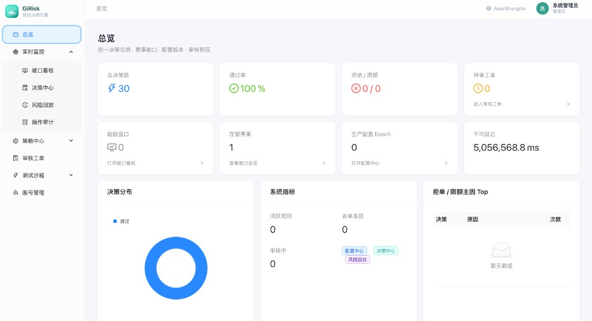

### 实时监控

**敞口看板** — 在管赛事 KPI、赛事工作台筛选、门控开关、δ / 阈值配置与盘口明细（赛前 / 滚球）。

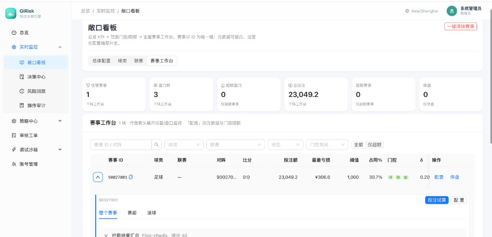

**决策中心** — 生产决策账本（`decision.v1`），支持订单号 / 赛事 ID 筛选与自动刷新。

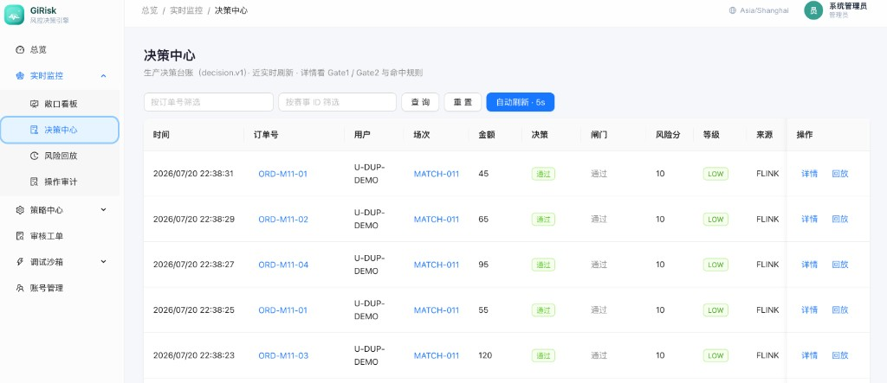

**风险回放** — 按订单、赛事或 Trace 还原闸门与限额解释；管理员可配置 Doris 审计源。


**操作审计** — 账号变更、值班写限额/门控/停盘、登录登出全留痕。

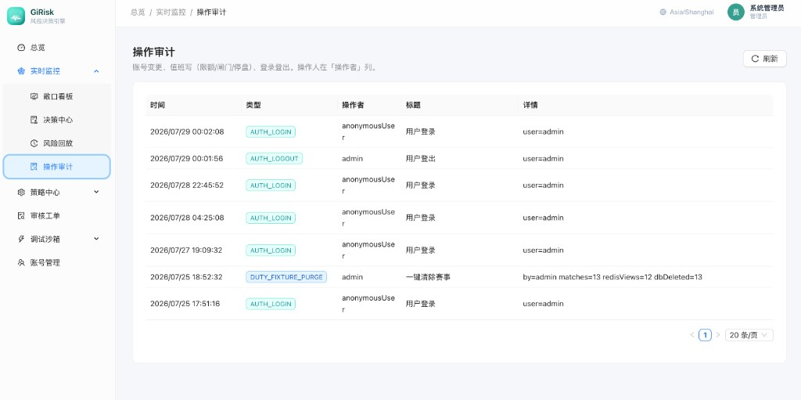

### 策略中心

**配置发布** — 参数集 / 规则集版本化；草稿 → 双人复核（δ、冷启动种子、最差亏损阈值等）。

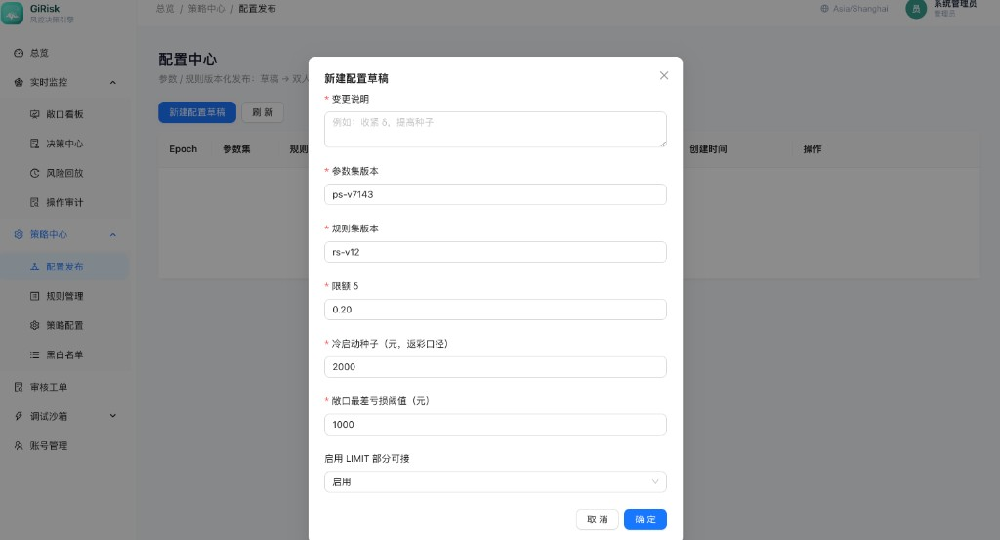

| 规则管理 | 策略配置 | 黑白名单 |
|:---:|:---:|:---:|
| 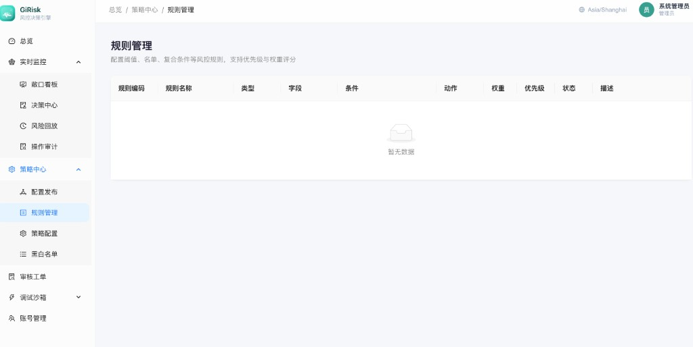 | 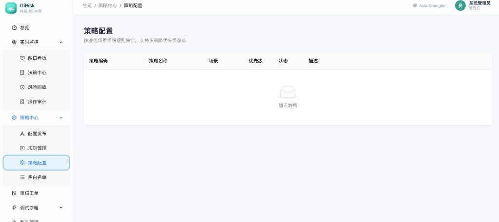 | 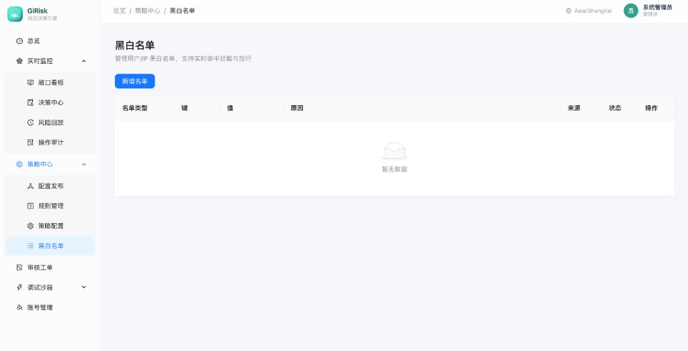 |

### 审核工单与沙箱

高风险订单人工复核，结论回写交易；调试沙箱覆盖订单/投注试算、管线观察与接口实验室。

| 审核中心 | 沙箱导航 |
|:---:|:---:|
| 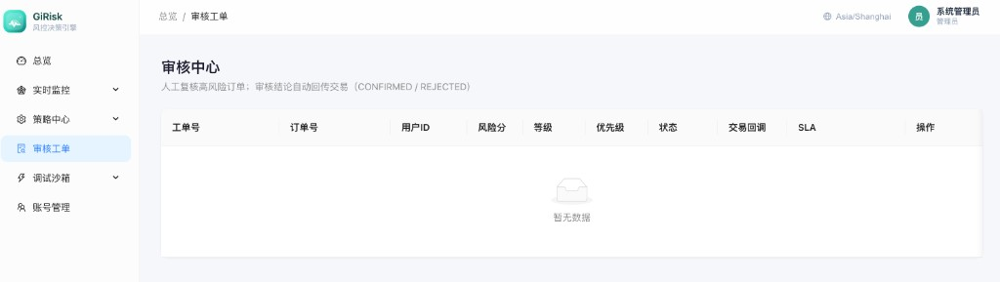 | 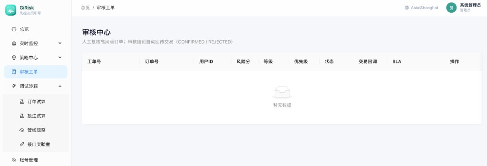 |

### 账号、时区与个性化

RBAC（用户 / 角色权限 / 权限目录）、展示时区（北京 · 伦敦 · 圣保罗 · 纽约 · 东京 …）、多主题与关于页。

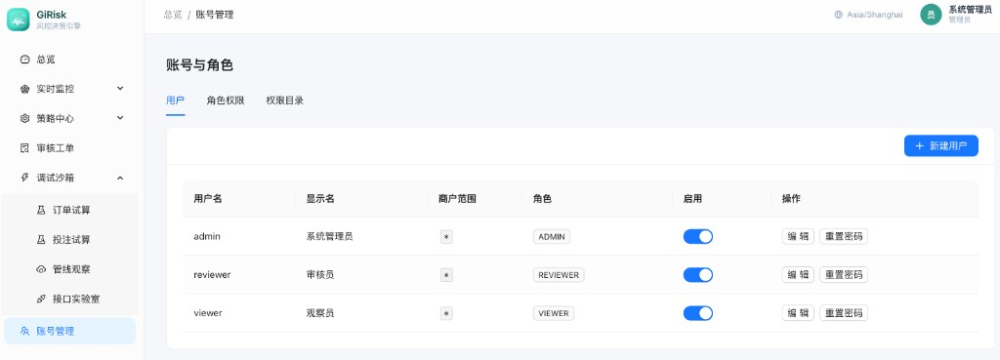

| 展示时区 | 用户菜单 |
|:---:|:---:|
| 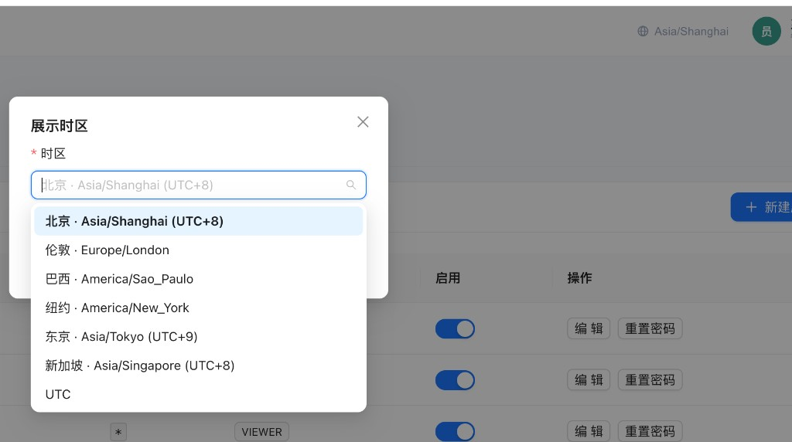 | 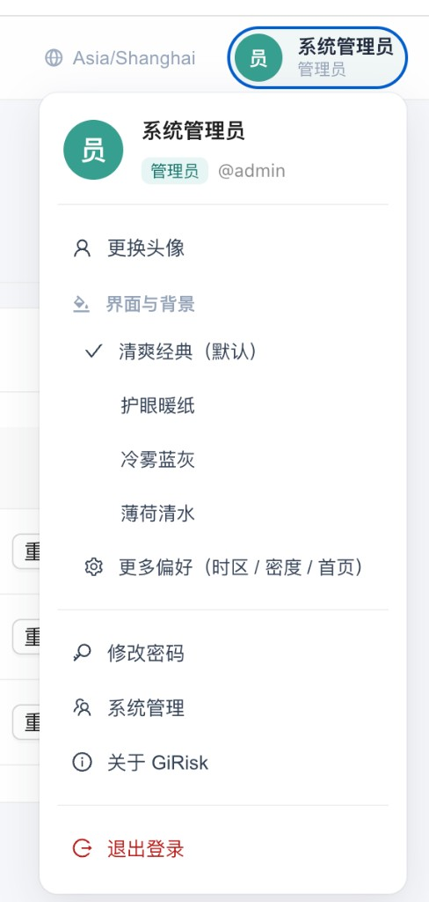 |

更多截图索引见 [docs/screenshots/README.md](docs/screenshots/README.md)。

---

## 一条链路

```
交易 → Kafka 预检 → Engine（内网 / gido）
                      ↓
              girisk.decision.v1
                      ↓
        交易 · Console 审计 · Redis 大盘

Console 值班配置 → girisk.config.v1 → Engine
```

---

## 仓库结构（GitLab 全量）

```
girisk-common/     契约
girisk-console/    运营台
girisk-engine/     Flink 决策（不同步到公开 GitHub）
doris/             审计 DDL
docs/              说明与截图
scripts/           演示 + sync-github.sh
deploy/            Console 镜像；flink/ 仅内网
```

| 文档 | 内容 |
|------|------|
| [docs/MONOREPO.md](docs/MONOREPO.md) | 模块与双远端 |
| [docs/PRODUCT-EXPOSURE.md](docs/PRODUCT-EXPOSURE.md) | 看板 / 四级限额 |
| [docs/AUDIT.md](docs/AUDIT.md) | Doris 审计 |
| [docs/CONSOLE-RBAC.md](docs/CONSOLE-RBAC.md) | 权限模型 |
| [docs/BRANDING.md](docs/BRANDING.md) | 品牌与命名 |
| [deploy/README.md](deploy/README.md) | Console → GHCR |

---

## 快速开始

### 环境

JDK 21+ · Maven 3.9+ · Node 18+ · Redis；（可选）Kafka / PostgreSQL 16 / Doris

### Console 演示

```bash
docker compose up -d redis
./start.sh --exposure-demo --background
# http://localhost:18088/girisk/exposure  admin / admin123
```

### 清洁链路 / 全栈

```bash
./start.sh --local --background
./start.sh --stack          # PG + Kafka + Redis + Doris + Console
```

### Engine jar（内网）

```bash
mvn -pl girisk-engine -am -DskipTests package
# → girisk-engine/target/girisk-engine-1.0.0.jar → gido 实时作业
```

### 镜像与对外同步

```bash
bash scripts/build-images.sh                 # 本地 Console 镜像
bash scripts/sync-github.sh                  # dry-run 导出公开子集
GITHUB_REMOTE=git@github.com:<org>/girisk.git bash scripts/sync-github.sh --push
```

公开 GHCR：`ghcr.io/<owner>/girisk/girisk-console:latest`（见 `.github/workflows/docker-publish.yml`）。

---

## 社区与合规

- 贡献：[CONTRIBUTING.md](CONTRIBUTING.md) · 行为准则：[CODE_OF_CONDUCT.md](CODE_OF_CONDUCT.md)
- 安全披露：[SECURITY.md](SECURITY.md) · 维护者：[MAINTAINERS.md](MAINTAINERS.md)
- 免责声明：[DISCLAIMER.md](DISCLAIMER.md)

## License

Apache-2.0 — 见 [LICENSE](LICENSE)。
