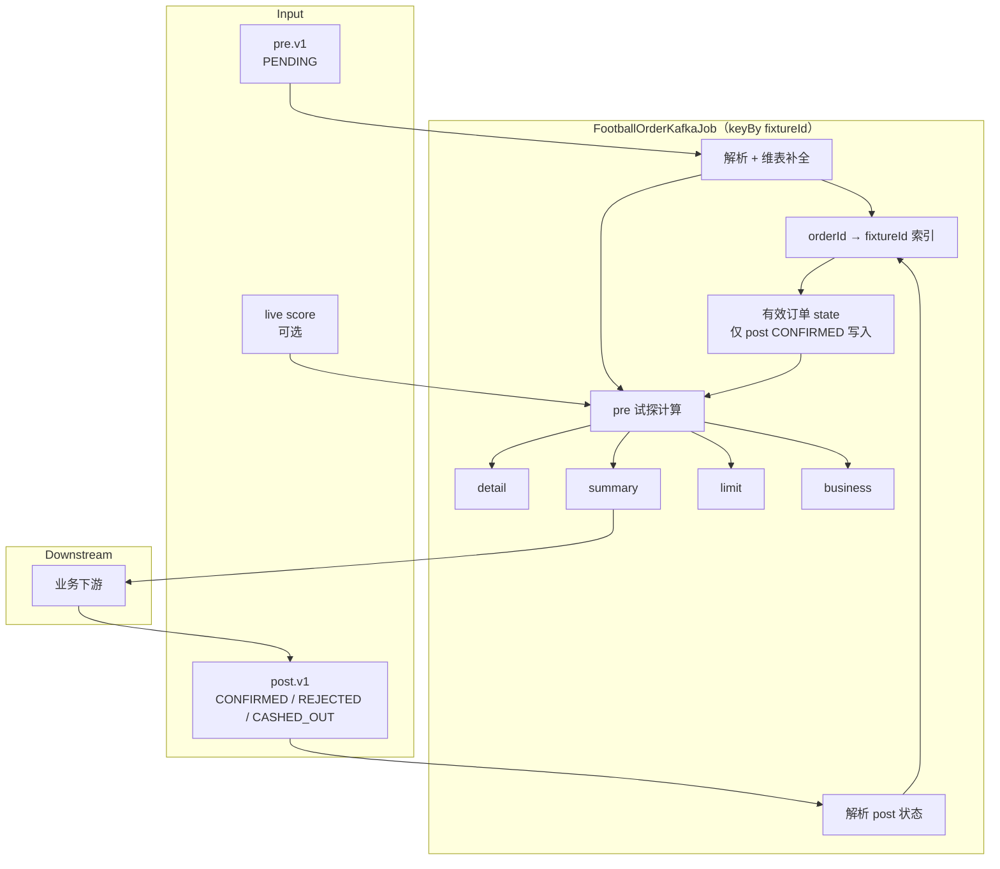
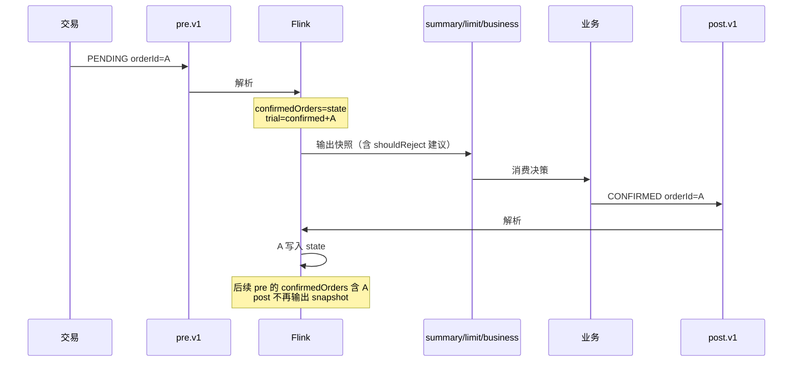

# 足球订单风控链路 — 总体设计方案

作业入口：`com.girisk.flink.risk.FootballOrderKafkaJob`

本文描述**当前生产架构**：pre 试探计算 + post 权威状态，Limit 仅基于 post 已 CONFIRMED 的有效订单（跳车单不参与限额基数）。

各输出 topic 字段细节见：

- [football-order-summary-kafka-schema.md](football-order-summary-kafka-schema.md)
- [football-order-limit-kafka-schema.md](football-order-limit-kafka-schema.md)
- [football-order-business-kafka-schema.md](football-order-business-kafka-schema.md)
- [football-order-kafka-job-config.md](football-order-kafka-job-config.md)

---

## 1. 设计目标

| 目标 | 说明 |
|------|------|
| 下单前风控 | 消费 pre topic 的 PENDING 单，实时算敞口 / 限额，输出给业务决策 |
| 权威持仓 | 有效订单集仅由 post topic 维护，不依赖 pre 内部「自写 state」 |
| 输出分离 | detail / summary / limit / business 四个结果 topic 继续独立存在 |
| 业务汇总 | business topic = summary 流 ∪ limit 流（union all，单 topic 订阅） |

---

## 2. Kafka Topic 一览

### 2.1 输入

| Topic | 默认名 | 消息条件 | 作用 |
|-------|--------|----------|------|
| **pre** | `girisk.trading.order.risk-check.v1` | `OrderRiskCheckEvent` + `status=PENDING` + `phase=PRE_CONFIRM` | 触发试探计算与结果输出 |
| **post** | `girisk.trading.order.risk-check.post.v1` | `status=CONFIRMED` / `REJECTED` / `CASHED_OUT` | 维护场次有效订单 state |
| **滚球比分**（可选） | `girisk.sportsdata.fixture.match.summary` | 比分 JSON | 动态 6×6 网格基准 |

pre / post 使用**同一 envelope**（`eventType=OrderRiskCheckEvent`），靠 **topic + payload.status** 区分阶段。

### 2.2 输出

| Topic | 默认名 | 触发时机 |
|-------|--------|----------|
| detail | `girisk.football.detail.result` | 每笔 pre PENDING |
| summary | `girisk.football.summary.result` | 每笔 pre PENDING |
| limit | `girisk.football.limit.result` | 每笔 pre PENDING |
| business | `girisk.football.business.result` | 每笔 pre PENDING |

**post 状态回传不触发任何输出 topic**（选项 A：pre 驱动输出，post 只改 state）。

---

## 3. 总体流程



---

## 4. pre / post 职责

### 4.1 pre — 试探与输出

每笔 **PENDING** 到达时：

1. 从 state 读取当前 **post 已 CONFIRMED 且未被剔除** 的订单 → `confirmedOrders`
2. 构造试探集 `trial = confirmedOrders + 本笔 PENDING`（duplicate 时不再重复加）
3. 计算 6×6 敞口、等比例限额、拒单建议
4. 写入 detail / summary / limit / business
5. **不写入 state**（无论 `shouldReject`  true/false）

Summary / Limit 中的 `triggerOrder` 为本笔 PENDING；`triggerRejected` / `shouldReject` 为**建议值**，下游可 override。

### 4.2 post — 权威 state

| status | state 行为 | 是否参与 Limit 基数 |
|--------|------------|---------------------|
| **CONFIRMED** | 按 `orderId` 加入/更新（需有 legs 订单明细） | **是** |
| **REJECTED** | 不加入；若已存在则移除 | 否 |
| **CASHED_OUT** | 从 state **移除** | **否**（跳车单不再占限额） |

有效 Limit 窗口 = **当前 state 中的 CONFIRMED 集合**（自然已排除 REJECTED 与 CASHED_OUT）。

> **维持现状**：跳车（CASHED_OUT）只负责出窗，**不参与** limit 加总；不做「跳车仍占限额」的保守口径。

---

## 5. Limit 计算规则（post 回传模式）

当 `--source.post.enabled true`（默认，且配置了 post topic）：

| 字段 / 逻辑 | 数据来源 |
|-------------|----------|
| `marketGroups` | 仅 **post CONFIRMED** 有效订单聚合（返彩口径 + 冷启动种子，v4） |
| `rejectReason` | `LIMIT`（返彩 >= b_max）/ `EXPOSURE`（试探最差净亏超 `--exposure.maxWorstLossYuan`）/ `NONE` |
| `maxExposureYuan` | 含本笔 PENDING 的试探窗口最差净亏（Gate 2 同源） |
| `shouldReject` / `acceptMaxBefore` | CONFIRMED 窗口 + 种子 与本笔 PENDING 的 `proposedPayout` 比较（`>=` 拒） |
| `marketGroupsIncludingTrigger` | CONFIRMED + 本笔 **PENDING**（仅展示试探，非权威持仓） |

Limit JSON 标识：

```json
{
  "limitBasis": "postConfirmedPrior",
  "confirmedOrderSource": "girisk.trading.order.risk-check.post.v1"
}
```

---

## 6. Summary 计算规则（post 回传模式）

| 字段 | 含义 |
|------|------|
| `windowOrderCount` | 当前 **CONFIRMED** 有效单数（不含本笔 PENDING） |
| `windowStakeYuan` / `maxProfitYuan` | 基于 CONFIRMED 窗口重算 |
| `assumedScores` | 全网格 36 格（仅 summary topic；business 中省略） |
| `triggerRejected` | 本笔 PENDING 的建议拒单，非 post 最终态 |

---

## 7. business topic

**union all**：summary 与 limit 各写一条 business，结构固定，另一侧为 `null`。

每笔 pre PENDING → business **两条**（与 summary / limit topic 同触发）：

| 来源 | business 消息 |
|------|---------------|
| summary 同行 | `{ "summaryData": {…}, "limitData": null }` |
| limit 同行 | `{ "summaryData": null, "limitData": {…} }` |

- `summaryData` 与 summary topic 相同，**去掉** `assumedScores`
- `limitData` 与 limit topic **完全相同**
- 下游按 `summaryData != null` / `limitData != null` 区分即可，无需额外分支逻辑

---

## 8. 时序示例



---

## 9. 消息格式（交易 envelope）

### pre 示例（PENDING）

```json
{
  "eventType": "OrderRiskCheckEvent",
  "aggregateId": "328510871913336833",
  "payload": {
    "orderId": "328510871913336833",
    "status": "PENDING",
    "phase": "PRE_CONFIRM",
    "stake": 1.0,
    "betTime": "2026-06-25T12:24:55.305625112Z",
    "legs": [{
      "fixtureId": "14057476",
      "legPick": { "type": "1X2", "line": 0, "side": "HOME" },
      "price": 1.38
    }]
  }
}
```

### post 示例（CONFIRMED）

```json
{
  "eventType": "OrderRiskCheckEvent",
  "payload": {
    "orderId": "328506241570066433",
    "status": "CONFIRMED",
    "phase": "POST_CONFIRM",
    "confirmedAt": "2026-06-25T12:06:38.332116Z",
    "legs": [{ "fixtureId": "13999839", "legPick": { "type": "OU", "side": "OVER", "line": 3 }, "price": 2.15 }]
  }
}
```

### post 示例（REJECTED，可无 legs）

```json
{
  "eventType": "OrderRiskCheckEvent",
  "payload": {
    "orderId": "328474399034564609",
    "status": "REJECTED",
    "phase": "POST_CONFIRM",
    "legs": []
  }
}
```

REJECTED 无 `fixtureId` 时，依赖同 `orderId` 的 pre 索引补全分区键；索引缺失则 WARN 跳过。

---

## 10. 作业参数（生产推荐）

```bash
--source.topic.pre    girisk.trading.order.risk-check.v1
--source.topic.post   girisk.trading.order.risk-check.post.v1
--source.post.enabled true
--offset.pre          latest      # 只消费新试探单
--offset.post         earliest    # 重建 CONFIRMED state
--group.id            girisk-engine-prod
--group.id.post       girisk-engine-prod-post   # 可选，默认 {group.id}-post

--limit.enabled       true
--limit.delta         0.2
--limit.initialSeedPayoutYuan 2000
--exposure.maxWorstLossYuan   1000

--sink.topic.summary  girisk.football.summary.result
--sink.topic.limit    girisk.football.limit.result
--sink.topic.business girisk.football.business.result
--sink.topic.detail   girisk.football.detail.result
```

联调可选：`--source.accept.csv true`（pre 额外接受 14 列 CSV，生产关闭）。

---

## 11. 关键代码模块

| 模块 | 职责 |
|------|------|
| `RiskOrderIngress` | 双 Kafka 源、解析、合并为 `RiskOrderStreamEvent` |
| `OrderPostFixtureEnrichFunction` | orderId → fixtureId 索引，post 补齐分区 |
| `ConfirmedOrderWindowState` | post CONFIRMED 入窗 / REJECTED·CASHED_OUT 出窗 |
| `MatchTriggerAcceptance` | pre 试探：confirmed vs trial，postFeedback 模式分支 |
| `MatchExposureSnapshotEmitter` | 同触发写 summary / limit / business |
| `MatchExposureKafkaProcessFunction` | 按 fixture 累计 state + pre 输出 |

---

## 12. 边界与约定

| 场景 | 处理 |
|------|------|
| post 先于 pre | CONFIRMED 可先入 state；后续 pre 时 prior 已含该单 |
| pre 重复 PENDING | 仍输出 snapshot；duplicate 标记，trial 不重复加单 |
| 建议拒单但 post CONFIRMED | 允许；Flink 不校验一致性，CONFIRMED 仍入 state |
| CASHED_OUT | 从 state 移除，不再参与 limit / summary 窗口 |
| 场次清理 | 开赛后 N 小时（默认 3h）event-time 定时器清空 state |

---

## 13. 与旧单源模式的区别

| 项 | 旧模式（`source.post.enabled false`） | 当前模式（post 回传） |
|----|--------------------------------------|------------------------|
| 输入 | 单 topic / CSV | pre + post |
| state 写入 | pre 内部 persist（含拒单逻辑） | **仅 post CONFIRMED** |
| Limit 基数 | 内部已接单集 | **post 有效 CONFIRMED** |
| limitBasis | `priorToTrigger` | `postConfirmedPrior` |

生产环境使用 **post 回传模式**。
