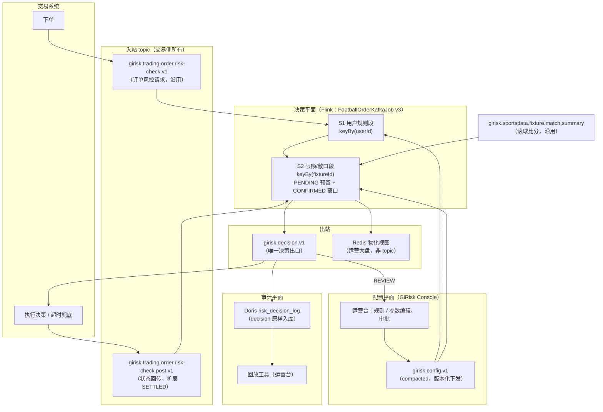

# GiRisk — 公司级风控决策引擎总体方案（v3：单一决策出口）

| 项 | 内容 |
|----|------|
| 产品 | **GiRisk**（代号 GIRISK，gido 全家桶） |
| 文档版本 | v3.0（评审稿） |
| 日期 | 2026-07-15 |
| 状态 | 待评审：风控产品 / 交易 / 数据 / SRE |
| 适用范围 | GiRisk Engine（`girisk-engine`）、GiRisk Console（`girisk-console`）、交易系统（契约对接方）、数据平台（Doris 审计） |
| 前置文档 | [football-order-risk-pipeline-design.md](football-order-risk-pipeline-design.md)（现行 pre/post 架构）、[football-order-risk-limit-first-design.md](football-order-risk-limit-first-design.md)（v2 先限额后敞口）、[BRANDING.md](BRANDING.md) |
| 取代 | 四个输出 topic（detail / summary / limit / business）的对外契约；Console 体育投注在线裁决（`/api/v1/sports/bet/evaluate`） |

---

## 1. 背景与问题

当前公司曾有两套并行的体育投注风控实现（现已收敛为 **GiRisk**）：

| | 原 flink-kafka-print → **GiRisk Engine** | 原 riskPlatform → **GiRisk Console** |
|---|---|---|
| 定位 | 敞口 / 限额实时计算（Flink 2.0.1 on K8s） | 规则引擎 + 运营台（Spring Boot） |
| 敞口 | 比分矩阵（默认 6×6）× 结算引擎，最差庄家净亏 | 各盘口 stake 求和（无赔率，伪敞口） |
| 限额 b_max | 返彩口径（stake×odds）+ 冷启动种子，恒开 | 本金口径，敞口超阈值才开（limitMode） |
| 拒单边界 | `payout >= b_max`（含等号） | `amount > bMax`（不含等号） |
| 状态 | Flink ListState（post CONFIRMED 窗口） | Redis 自行累加 stakes |
| 输出 | 4 个结果 topic 中的 `shouldReject` 建议 | 同步 HTTP + `girisk.decision.event` |

两套实现**公式同源但口径冲突、状态双写、决策面重复**，同一笔投注可能得出相反结论。此外现行 Flink 输出契约（detail / summary / limit / business 四个 topic）对交易侧过重：交易只需要一个结论，却要理解四种 schema。

**本方案确定的方向（2026-07-15 决策）**：输入一笔订单，输出一个结论。决策权完整收敛到 Flink 决策引擎，输出收敛为单一决策 topic，每条决策消息自包含理由、命中规则、版本与证据快照，全系统可审计、可回溯。

---

## 2. 目标与非目标

### 2.1 目标

1. **单一决策出口**：交易系统发一笔订单请求，在唯一的决策 topic 上收到一个结论（PASS / REJECT / LIMIT / REVIEW）。
2. **决策可解释**：每条决策消息包含命中规则（ruleId + ruleVersion）、拒单理由文案、判定证据（b_max、各盘口返彩、最差亏损格等）。
3. **决策可回溯**：版本三元组（规则版本 + 参数集版本 + 引擎构建版本）+ 特征快照随消息落盘，任何历史决策仅凭消息本体即可还原现场。
4. **决策权唯一**：并发竞态在 GiRisk Engine 内根治（PENDING 预留入 keyed state），GiRisk Console 不再在线裁决体育投注。
5. **规则 / 参数可配置**：δ、种子、敞口阈值、用户规则等全部经配置 topic 版本化下发，变更不发版、不重启作业。
6. **全链路审计**：决策 topic 原样入 Doris，运营台支持按订单回放。

### 2.2 非目标（本期不做）

- 串关 / 复式的组合敞口（Phase 2）
- 网格隐含概率加权（等权保留，留扩展点）
- 模型评分（sharp bettor、团伙检测等，Phase 3，依赖结算盈亏标签积累）
- 非体育场景的通用风控（GiRisk Console 通用规则引擎按现状保留）

---

## 3. 总体架构

三平面分工，决策权唯一在决策引擎：



| 平面 | 承载系统 | 职责 |
|------|----------|------|
| 决策平面 | GiRisk Engine（`girisk-engine`） | 唯一裁决点：用户规则 + 等比例限额 + 比分矩阵敞口；维护 PENDING 预留与 CONFIRMED 窗口；输出决策消息与 Redis 大盘视图 |
| 配置平面 | GiRisk Console（`girisk-console`） | 规则 / 参数的编辑、审批、版本化下发；REVIEW 工单；运营大盘（读 Redis）；回放（查 Doris）。**不再在线裁决体育投注** |
| 审计平面 | Kafka + Doris | 决策消息原样落库；配置变更历史；回放与报表 |

---

## 4. Kafka 契约总览

### 4.1 Topic 清单（3 入 1 出 + 1 配置）

| 角色 | Topic | 方向 | Key | 清理策略 | 所有权 | 状态 |
|------|-------|------|-----|----------|--------|------|
| 订单风控请求 | `girisk.trading.order.risk-check.v1` | 交易 → 引擎 | orderId | delete，保留 7d | 交易 | 沿用 |
| 订单状态回传 | `girisk.trading.order.risk-check.post.v1` | 交易 → 引擎 | orderId | delete，保留 7d | 交易 | 沿用，**扩展 SETTLED** |
| 滚球比分 | `girisk.sportsdata.fixture.match.summary` | 数据 → 引擎 | fixtureId | delete | 体育数据 | 沿用 |
| **风控配置下发** | `girisk.config.v1` | riskPlatform → 引擎 | scope（`global` 或 operatorId） | **compact** | 风控 | **新增** |
| **风控决策** | `girisk.decision.v1` | 引擎 → 交易 / Doris / 运营台 | orderId | delete，保留 30d | 风控 | **新增** |

### 4.2 退役清单

| Topic | 现内容 | 去向 |
|-------|--------|------|
| `girisk.football.limit.result` | b_max 快照 + shouldReject 建议 | 拒单建议升级为 `girisk.decision.v1` 正式决策；b_max 证据进 decision 消息 `evidence` |
| `girisk.football.business.result` | summary ∪ limit union | 同上 |
| `girisk.football.summary.result` | 场次 36 格快照 | 写 Redis 物化视图（§11.2）供运营大盘；历史查 Doris |
| `girisk.football.detail.result` | 订单 × 比分格明细 | 不再实时输出；decision 消息证据快照足以回放，全矩阵按 `--debug.detailMatrix` 开关临时开启或离线重算 |

> 注意：k8s prod yaml 中的短名（`football.order.detail` 等）与代码默认名（`football.order.risk.*.result`）存在漂移，随本次契约定稿一并清理。

### 4.3 通用约定

- 消息体 JSON UTF-8；金额一律 **分（cents）整数**；赔率一律 **字符串小数**（如 `"2.100"`），解析方必须用 BigDecimal。
- 每条消息含 `schemaVersion`（整数）。**向后兼容变更**（新增可选字段）不升版本；**破坏性变更**升版本并双写过渡 ≥ 30 天。
- `traceId` 由交易侧在请求消息生成（UUID），全链路透传：request → decision → status → Doris。

---

## 5. 消息契约详情

### 5.1 入站：订单风控请求（沿用 envelope，补齐字段）

沿用现行 `OrderRiskCheckEvent` envelope（`eventType` + `payload.status=PENDING` + `phase=PRE_CONFIRM`）。本方案**不改动 envelope 结构**，仅要求 payload 补齐以下字段（现有解析器 `FootballOrderUnifiedParser` 已支持大部分）：

| 字段 | 类型 | 必填 | 说明 |
|------|------|------|------|
| `traceId` | string | **新增必填** | 交易侧生成，全链路透传 |
| `orderId` | string | 必填 | 幂等键 |
| `userId` | string | **升级为必填** | 用户规则段依赖；现有模型已有此字段 |
| `operatorId` | string | 必填 | 租户 / 商户维度（多租户隔离键） |
| `fixtureId` / `eventId` | string | 必填 | 场次 |
| `playType` / `parlayType` / `handicap` / `selection` | string | 必填 | 玩法与选项（`PlayTypeRegistry` 解析） |
| `odds` | string decimal | 必填 | 下单时赔率 |
| `stakeCents` | long | 必填 | 本金（分）。过渡期兼容 `stakeYuan` |
| `orderTime` | ISO-8601 / epoch ms | 必填 | 事件时间（watermark 依据） |

### 5.2 入站：订单状态回传（扩展 SETTLED）

沿用现行 post topic，status 枚举扩展：

| status | 引擎行为 | 变化 |
|--------|----------|------|
| `CONFIRMED` | PENDING 预留转正式入窗（参与限额基数与敞口） | 语义不变，来源从「重算」改为「预留转正」 |
| `REJECTED` | 释放预留；已入窗则移除 | 不变 |
| `CASHED_OUT` | 出窗（跳车不占限额） | 不变 |
| `SETTLED` | **新增**：赛果结算，订单出窗并释放敞口；payload 携带 `settlePnlCents`（平台盈亏，供审计与后续建模） | 替代现行「开赛 +3h 定时清理」的粗放兜底（保留该定时器作为最终兜底） |

### 5.3 配置下发：`girisk.config.v1`

Compacted topic，key = scope。引擎以 Broadcast State 接入，配置对**之后到达的订单**生效（按 Kafka offset 顺序，天然可回放）。

```json
{
  "schemaVersion": 1,
  "configEpoch": 42,
  "scope": "global",
  "publishedAt": "2026-07-15T08:00:00Z",
  "publishedBy": "risk-ops:zhang.san",
  "approvalTicket": "RISK-2026-0715-01",
  "paramSet": {
    "version": "ps-v7",
    "limit": {
      "delta": 0.2,
      "basis": "payout",
      "initialSeedPayoutCents": 200000,
      "rejectBoundary": "GTE"
    },
    "exposure": {
      "maxWorstLossCents": 100000,
      "grid": { "home": 6, "away": 6, "liveScoreDynamic": true }
    },
    "decision": {
      "limitDecisionEnabled": true,
      "unknownPlayTypePolicy": "REVIEW",
      "pendingReserveTtlMs": 30000
    }
  },
  "ruleSet": {
    "version": "rs-v12",
    "rules": [
      {
        "ruleId": "R_USER_BLACKLIST", "ruleVersion": 3, "stage": "USER",
        "type": "LIST_HIT", "action": "REJECT", "priority": 1,
        "params": { "listCode": "USER_BLACK" }
      },
      {
        "ruleId": "R_USER_STAKE_5M", "ruleVersion": 2, "stage": "USER",
        "type": "THRESHOLD", "field": "stake_sum_5m_cents",
        "op": "GT", "value": 10000000, "action": "REVIEW", "priority": 10
      }
    ]
  }
}
```

要点：

- **配置不可变**：每次变更产生新 `configEpoch`（单调递增），旧 epoch 定义永久保留（riskPlatform MySQL + Doris `risk_config_log`）。禁止原地修改。
- **现有 CLI 参数迁移**：`--limit.delta`、`--limit.initialSeedPayoutYuan`、`--exposure.maxWorstLossYuan` 等从启动参数改为 config topic 下发；CLI 值仅作冷启动 fallback（config 到达前不裁决，见 §9.3）。
- **scope 分层**：`global` 为默认；operatorId scope 覆盖 global（多租户差异化限额，Phase 2 启用）。
- 名单类规则若条目过大，config 消息只下发名单版本号，条目经旁路（Redis / 广播文件）加载，命中时 decision 消息记录名单版本。

### 5.4 出站：`girisk.decision.v1`（核心契约）

**每笔请求必有一条决策**（包括 PASS）。放行比拒单更需要解释——审计的第一问往往是「当时为什么放了」。

#### 字段表

| 字段 | 类型 | 说明 |
|------|------|------|
| `schemaVersion` | int | 契约版本，当前 1 |
| `traceId` | string | 透传请求 traceId |
| `orderId` | string | 订单号（也是 Kafka key） |
| `userId` / `operatorId` / `fixtureId` | string | 透传维度 |
| `market` | object | `{ playType, marketFamily, line, selection }` |
| `stakeCents` | long | 本金（分） |
| `odds` | string | 下单赔率 |
| `payoutCents` | long | 返彩 = stake × odds（限额判定口径） |
| `decision` | enum | `PASS` / `REJECT` / `LIMIT` / `REVIEW` |
| `maxAcceptableStakeCents` | long? | 仅 `decision=LIMIT`：本单可接的最大本金（分），= floor((b_max − ε) / odds) |
| `reasons` | array | 命中明细，按优先级排序，首条为主因；PASS 时为空数组 |
| `reasons[].ruleId` | string | 命中规则 / 闸门 ID。内置闸门固定为 `R_LIMIT_PROPORTIONAL`、`R_EXPOSURE_WORST_LOSS` |
| `reasons[].ruleVersion` | int | 规则定义版本 |
| `reasons[].stage` | enum | `USER` / `GATE1_LIMIT` / `GATE2_EXPOSURE` |
| `reasons[].action` | enum | 该规则的动作（REJECT / LIMIT / REVIEW） |
| `reasons[].message` | string | 人类可读理由（运营台直接展示） |
| `reasons[].evidence` | object | 判定证据（见示例；结构随 stage 不同） |
| `versions` | object | `{ configEpoch, paramSetVersion, ruleSetVersion, engineBuild }` — 版本三元组 + 参数集 |
| `featureSnapshot` | object | 决策时刻现场：`confirmedOrders`、`pendingReserved`、`worstLossCents`、`worstScore`、`liveScore`、`gridSpec`、`duplicateIgnored` |
| `eventTime` | ISO-8601 | 订单事件时间 |
| `decisionTime` | ISO-8601 | 决策产生时间 |
| `latencyMs` | long | 引擎内处理耗时 |

#### 示例 1：PASS

```json
{
  "schemaVersion": 1,
  "traceId": "tr-7f3a9c",
  "orderId": "ORD-20260715-000123",
  "userId": "U888", "operatorId": "OP-A001", "fixtureId": "FX10001",
  "market": { "playType": "OverUnder", "marketFamily": "OVER_UNDER", "line": "2.5", "selection": "OVER" },
  "stakeCents": 100000, "odds": "1.950", "payoutCents": 195000,
  "decision": "PASS",
  "maxAcceptableStakeCents": null,
  "reasons": [],
  "versions": { "configEpoch": 42, "paramSetVersion": "ps-v7", "ruleSetVersion": "rs-v12", "engineBuild": "2026.07.15-a1b2c3" },
  "featureSnapshot": {
    "confirmedOrders": 37, "pendingReserved": 1,
    "worstLossCents": -84000, "worstScore": "2:1",
    "liveScore": "1:0", "gridSpec": "1-6x0-5", "duplicateIgnored": false,
    "gate1": { "bMaxCents": 483500, "groupPayoutCents": { "OVER": 1200000, "UNDER": 900000 }, "seedCents": 200000 }
  },
  "eventTime": "2026-07-15T07:59:58.120Z",
  "decisionTime": "2026-07-15T07:59:58.131Z",
  "latencyMs": 8
}
```

#### 示例 2：REJECT（Gate1 限额）

```json
{
  "schemaVersion": 1,
  "traceId": "tr-8b21de",
  "orderId": "ORD-20260715-000124",
  "userId": "U777", "operatorId": "OP-A001", "fixtureId": "FX10001",
  "market": { "playType": "MatchResult", "marketFamily": "ONE_X_TWO", "line": "", "selection": "HOME" },
  "stakeCents": 500000, "odds": "2.100", "payoutCents": 1050000,
  "decision": "REJECT",
  "maxAcceptableStakeCents": null,
  "reasons": [{
    "ruleId": "R_LIMIT_PROPORTIONAL", "ruleVersion": 2,
    "stage": "GATE1_LIMIT", "action": "REJECT",
    "message": "本单返彩 10500.00 元 ≥ 盘口可接上限 4596.70 元（1X2 组，δ=0.2，w=1/3）",
    "evidence": {
      "bMaxCents": 459670,
      "groupPayoutCents": { "HOME": 2800000, "DRAW": 600000, "AWAY": 900000 },
      "seedCents": 200000, "delta": 0.2, "weight": "1/3", "boundary": "GTE"
    }
  }],
  "versions": { "configEpoch": 42, "paramSetVersion": "ps-v7", "ruleSetVersion": "rs-v12", "engineBuild": "2026.07.15-a1b2c3" },
  "featureSnapshot": { "confirmedOrders": 52, "pendingReserved": 0, "worstLossCents": -96000, "worstScore": "1:0", "liveScore": null, "gridSpec": "0-5x0-5", "duplicateIgnored": false },
  "eventTime": "2026-07-15T08:00:01.002Z",
  "decisionTime": "2026-07-15T08:00:01.010Z",
  "latencyMs": 6
}
```

#### 示例 3：LIMIT（部分可接，需产品确认启用，见 §14）

```json
{
  "schemaVersion": 1,
  "traceId": "tr-9c44aa",
  "orderId": "ORD-20260715-000125",
  "userId": "U555", "operatorId": "OP-B002", "fixtureId": "FX10002",
  "market": { "playType": "AsianHandicap", "marketFamily": "HANDICAP", "line": "-0.75", "selection": "HOME" },
  "stakeCents": 300000, "odds": "1.900", "payoutCents": 570000,
  "decision": "LIMIT",
  "maxAcceptableStakeCents": 121000,
  "reasons": [{
    "ruleId": "R_LIMIT_PROPORTIONAL", "ruleVersion": 2,
    "stage": "GATE1_LIMIT", "action": "LIMIT",
    "message": "本单返彩 5700.00 元超过可接上限 2299.90 元，本单最多可接本金 1210.00 元",
    "evidence": { "bMaxCents": 229990, "groupPayoutCents": { "HOME": 800000, "AWAY": 400000 }, "seedCents": 200000, "delta": 0.2, "weight": "1/2" }
  }],
  "versions": { "configEpoch": 42, "paramSetVersion": "ps-v7", "ruleSetVersion": "rs-v12", "engineBuild": "2026.07.15-a1b2c3" },
  "featureSnapshot": { "confirmedOrders": 12, "pendingReserved": 0, "worstLossCents": -31000, "worstScore": "0:2", "liveScore": null, "gridSpec": "0-5x0-5", "duplicateIgnored": false },
  "eventTime": "2026-07-15T08:00:05.500Z",
  "decisionTime": "2026-07-15T08:00:05.507Z",
  "latencyMs": 7
}
```

#### 示例 4：REVIEW（用户规则段命中）

```json
{
  "schemaVersion": 1,
  "traceId": "tr-a1b2c3",
  "orderId": "ORD-20260715-000126",
  "userId": "U999", "operatorId": "OP-A001", "fixtureId": "FX10003",
  "market": { "playType": "MatchResult", "marketFamily": "ONE_X_TWO", "line": "", "selection": "AWAY" },
  "stakeCents": 2000000, "odds": "6.500", "payoutCents": 13000000,
  "decision": "REVIEW",
  "maxAcceptableStakeCents": null,
  "reasons": [{
    "ruleId": "R_USER_STAKE_5M", "ruleVersion": 2,
    "stage": "USER", "action": "REVIEW",
    "message": "用户 5 分钟投注总额 128000.00 元超过 100000.00 元，转人工审核",
    "evidence": { "stakeSum5mCents": 12800000, "thresholdCents": 10000000, "betCount5m": 41 }
  }],
  "versions": { "configEpoch": 42, "paramSetVersion": "ps-v7", "ruleSetVersion": "rs-v12", "engineBuild": "2026.07.15-a1b2c3" },
  "featureSnapshot": { "confirmedOrders": 8, "pendingReserved": 0, "worstLossCents": -12000, "worstScore": "0:3", "liveScore": null, "gridSpec": "0-5x0-5", "duplicateIgnored": false },
  "eventTime": "2026-07-15T08:00:09.000Z",
  "decisionTime": "2026-07-15T08:00:09.009Z",
  "latencyMs": 9
}
```

---

## 6. 决策语义

### 6.1 决策链（作业内两段 keyBy，一条消息出结论）

```text
request（PENDING）
  → S0 解析 / 幂等（orderId 重复 → 重发上次决策，duplicateIgnored=true）
  → S1 用户规则段  keyBy(userId)
       名单 / 频次 / 单用户限额（规则经 config broadcast 下发）
       维护用户维度状态：5m/24h 投注次数与金额等
       命中 REJECT → 直接出决策（短路）；命中 REVIEW / LIMIT → 记入 reasons 继续
  → S2 限额/敞口段  keyBy(fixtureId)
       Gate1 等比例限额（恒开，返彩口径 + 种子，复用 ProportionalLimitCalculator / LimitMarketType）
         payout_new >= b_max → REJECT(LIMIT)；limitDecisionEnabled 时给 maxAcceptableStakeCents → LIMIT
       Gate2 比分矩阵敞口（复用 MatchExposureAggregator / BetSettlementEngine）
         trial = CONFIRMED 窗口 + PENDING 预留 + 本笔
         最差净亏 > maxWorstLossCents → REJECT(EXPOSURE)
       通过 → 写 PENDING 预留（TTL 定时器） → PASS
  → 合并 reasons，产出唯一 decision 消息
```

裁决优先级：`REJECT > REVIEW > LIMIT > PASS`。多条命中全部记入 `reasons`，`decision` 取最严格动作。

### 6.2 判定口径（v2 结论沿用，全公司统一）

| 项 | 口径 | 依据 |
|----|------|------|
| 限额基数 | **返彩 payout = stake × odds**（gross liability） | v2 设计已评审：庄家风控管赔付不管本金 |
| b_max | \(b_{max} = \frac{(1+\delta)wS_{total} - S_i}{1-(1+\delta)w}\)，w=1/n，负值截断 0 | `ProportionalLimitCalculator`（两仓库同源，riskPlatform 侧退役） |
| 冷启动 | 组内每盘口虚拟种子（返彩口径），首单容量 = 种子/n | v2 已实现 |
| 拒单边界 | `>=`（等于也拒） | v2 产品确认 |
| 敞口 | 比分矩阵最差庄家净亏（`maxBookmakerLossCents`），网格默认 6×6，滚球以当前比分为基准延伸 | 现行实现 |
| 分组 | 1X2 三向 w=1/3；大小球同 line 两向 w=1/2；让球同绝对 line 两向 w=1/2 | `LimitMarketType`（让球方向对齐待产品确认，§14） |
| 金额精度 | 全链路分（cents）整数，BigDecimal 计算 | 现行实现 |

### 6.3 LIMIT 决策语义

`decision=LIMIT` 表示「本单按原金额不可接，但存在正的可接额度」：

- `maxAcceptableStakeCents = floor((bMaxCents − 1) / odds)`（保证接满后仍满足 `payout < b_max`）；
- 交易侧行为二选一（契约参数，由产品定）：向用户展示「本次最多可投 X」引导改单，或直接按 REJECT 处理；
- `limitDecisionEnabled=false` 时引擎降级输出 REJECT（与 v2 现状一致），保证开关可回退。

### 6.4 REVIEW 语义与人工闭环

1. 引擎输出 `decision=REVIEW`，**不写 PENDING 预留**（审核期间不占额度，防止恶意占坑）；
2. 交易系统挂起订单；riskPlatform 运营台消费 decision topic 自动建工单（复用现有 `risk_case`）；
3. 审核员在运营台裁决 → 运营台回调交易系统 → 交易系统发 status（`CONFIRMED` 或 `REJECTED`）闭环；
4. CONFIRMED 到达时引擎按正常入窗处理（此时重算敞口，若已恶化仍入窗——人工决策优先级高于机器闸门，但入窗事件照常反映在后续决策基数中）。

### 6.5 未识别玩法策略

现状「按输计敞口 + 不进限额组」意味着新玩法上线即绕过 Gate1。本方案改为可配置 `unknownPlayTypePolicy`：

| 值 | 行为 |
|----|------|
| `REVIEW`（默认） | 转人工审核，敞口按输计入 |
| `REJECT` | 直接拒 |
| `EXPOSURE_ONLY` | 维持现状（仅走 Gate2），用于灰度期 |

---

## 7. 状态管理

### 7.1 PENDING 预留（新增，根治并发击穿）

现行模型 PENDING 互不可见：确认回流前，多笔并发试探对着同一旧基数计算，会集体击穿限额。修复：决策与状态更新在同一个 `keyBy(fixtureId)` 算子内串行完成——

| 事件 | 状态动作 |
|------|----------|
| request 通过（PASS / LIMIT 改单后） | 立即写 PENDING 预留（payout 与订单快照），注册 TTL 定时器（`pendingReserveTtlMs`，默认 30s） |
| status CONFIRMED | 预留转正式入窗（预留缺失时直接入窗并告警——说明超时后才确认） |
| status REJECTED / CASHED_OUT | 释放预留 / 出窗 |
| TTL 到期 | 释放预留，发 `RESERVE_EXPIRED` 运维告警指标 |

Gate1 / Gate2 的基数 = CONFIRMED 窗口 + 有效 PENDING 预留。下一笔并发单看到的基数已含前一笔预留，限额不可能被并发击穿。

### 7.2 窗口生命周期

```text
PENDING 预留 ──CONFIRMED──► 窗口内（参与限额与敞口）
      │                          │
      ├─ REJECTED / TTL ─► 释放   ├─ CASHED_OUT ─► 出窗
                                 ├─ SETTLED ─► 出窗 + 记录 settlePnlCents（新增）
                                 └─ 开赛 + 3h 定时清理（保留，最终兜底）
```

### 7.3 状态运维纪律

- 所有 keyed state 声明稳定的 `TypeSerializer`，字段演进走 Flink state schema evolution；
- 作业升级流程固定为 savepoint → 部署 → 从 savepoint 恢复，每个迭代在预发演练一次「升级 + 恢复 + 决策连续性」验证；
- state 规模预算：单场次窗口订单数上限告警（如 5 万），防止异常场次撑爆 RocksDB。

---

## 8. 版本管理与可回溯

### 8.1 版本三元组

| 版本 | 含义 | 变更来源 |
|------|------|----------|
| `ruleSetVersion` / `reasons[].ruleVersion` | 规则定义版本 | 运营台发布（审批后） |
| `configEpoch` / `paramSetVersion` | δ、种子、阈值、网格等参数集 | 运营台发布（审批后） |
| `engineBuild` | 引擎代码版本（git describe） | CI 注入 |

三者齐备时，任何历史决策都能精确还原到当时的完整逻辑。**配置一律不可变**：修改 = 发布新版本，历史版本永久可查。

### 8.2 审计闭环

```text
decision topic ──原样──► Doris risk_decision_log（分区：日期；排序键：operatorId, fixtureId, orderId）
config topic  ──原样──► Doris risk_config_log
status topic  ──原样──► Doris risk_order_status_log（含 SETTLED 盈亏）
```

### 8.3 回放流程（运营台「风险回放」页）

1. 输入 orderId / traceId → Doris 查出 decision 消息；
2. 页面直接渲染：决策、reasons（含证据数值）、版本三元组、featureSnapshot——**仅凭消息本体即可回答「为什么拒 / 为什么放」**，不依赖任何在线系统；
3. 深度校验（可选）：按 `versions` 取出对应 config 定义 + featureSnapshot 重跑判定函数，验证结论一致（回归工具，也用于引擎升级后的历史一致性抽查）。

---

## 9. 可用性与 SLA

### 9.1 延迟预算

| 段 | 目标 |
|----|------|
| 引擎内处理（S0→出消息，`latencyMs`） | P99 < 20ms |
| 端到端（交易发 request → 收到 decision） | P99 < 200ms（含两跳 Kafka） |
| 决策消息滞后监控 | consumer lag > 5s 告警 |

### 9.2 交易侧超时兜底（必须写进对接契约）

Flink 重启 / 反压 / checkpoint 恢复期间决策会迟到。交易系统在 `decisionTimeoutMs`（建议 500ms～2s，按产品容忍度定）未收到决策时执行分级兜底：

| 盘口层级 | 兜底策略（建议初值，产品定稿） |
|----------|--------------------------------|
| 主流联赛主盘口 | fail-open：≤ 200 元本金放行，事后对账 |
| 滚球 / 冷门盘口 | fail-closed：拒单或转 REVIEW |

兜底放行的订单仍会经 status CONFIRMED 进入窗口，引擎恢复后基数自动校正；兜底决策由交易侧打标（`fallback=true`）入 Doris 供对账。

### 9.3 失败模式

| 场景 | 行为 |
|------|------|
| config 尚未到达（作业冷启动） | 不裁决，请求进入等待（broadcast state 就绪前 buffer），超过 `configWaitMs` 走 CLI fallback 参数并告警 |
| 滚球比分流中断 | 网格退回静态 0-5×0-5，快照标记 `liveScore=null`，不阻塞决策 |
| 解析失败订单 | 输出 `decision=REVIEW` + `ruleId=R_PARSE_ERROR`，原文进死信 topic `girisk.decision.dlq` |
| Doris 写入延迟 | 不影响决策链路（审计异步），lag 告警 |

---

## 10. GiRisk Console 侧改造

| 模块 | 改造 |
|------|------|
| 体育在线裁决 | `/api/v1/sports/bet/evaluate`、`SportsBetRiskService`、`RedisExposureStore` 自行累加逻辑 **退役**（迁移期保留只读 dry-run 供对比） |
| 规则中心 | 升级为配置平面：规则 / 参数编辑 → 审批（双人复核）→ 发布到 `girisk.config.v1`；所有版本入 MySQL（H2 → MySQL 迁移同步完成）并镜像到 Doris |
| 运营大盘 | 数据源从自算改为读 Flink 写出的 Redis 物化视图（§11.2） |
| 工单 | 消费 decision topic 的 REVIEW 自动建 `risk_case`；审核结论回调交易系统（补上现状「审核不回传」的断点） |
| 回放页 | 新增：按 orderId 查 Doris 渲染决策现场（§8.3） |
| 通用（非体育）风控 | 现有规则引擎与 HTTP evaluate 按现状保留，不在本方案范围 |

---

## 11. 数据与审计层

### 11.1 Doris 表

| 表 | 来源 | 关键设计 |
|----|------|----------|
| `risk_decision_log` | decision topic | 明细模型；分区 = decisionTime 日；排序键 operatorId / fixtureId / orderId；保留 ≥ 2 年 |
| `risk_config_log` | config topic | 全量版本历史，永久保留 |
| `risk_order_status_log` | status topic | 含 SETTLED 盈亏，供规则有效性分析与 Phase 3 建模标签 |

### 11.2 Redis 物化视图（运营大盘，非决策依赖）

由引擎在决策 / 状态变更后写入（填补现有 `risk/redis/` 空包）：

| Key | 结构 | 内容 |
|-----|------|------|
| `girisk:view:fixture:{fixtureId}` | Hash | worstLossCents、worstScore、confirmedCount、pendingReserved、liveScore、updatedAt |
| `girisk:view:market:{fixtureId}:{group}` | Hash | 各 selection 的 payoutCents、bMaxCents |
| `girisk:view:top:worstloss` | ZSet | 全平台最差亏损 TopN 场次（大盘「高危赛事」） |

注意：**Redis 视图只供展示，不参与决策**。决策依据全部在 Flink state 内，Redis 故障不影响裁决。

---

## 12. 多租户与安全

- `operatorId` 为租户隔离键：decision / Doris / Redis 视图全维度携带；config 支持 operator scope 覆盖（Phase 2 启用差异化限额模板）；
- config topic 生产权限仅 riskPlatform 服务账号；发布必须携带 `approvalTicket`（审批单号），引擎拒绝无审批号的配置；
- decision topic 消费方（交易 / Doris / 运营台）各自独立 consumer group，ACL 只读；
- 决策消息含用户维度数据，Doris 访问走运营台权限（复用现有 admin / reviewer / viewer 角色），禁止直连。

---

## 13. 迁移计划

| 里程碑 | 内容 | 验收标准 |
|--------|------|----------|
| **M0 契约定稿**（1 周） | 本文档评审通过；交易 / 数据 / 产品会签；k8s yaml 与代码 topic 名漂移一并清理 | 会签记录；§14 待决策项全部关闭 |
| **M1 引擎双跑**（2~3 周） | 引擎新增 decision topic 输出与 PENDING 预留，**旧四 topic 并行保留**；config topic 上线（先只承载参数，规则仍空）；riskPlatform 发布通道就绪 | 影子对比 ≥ 7 天：decision 与旧 `limit.shouldReject` 结论 diff < 0.1% 且每条 diff 可解释（预留生效导致的差异属预期收敛） |
| **M2 交易切换**（1~2 周） | 交易消费 decision 执行，实现超时兜底；status 扩展 SETTLED；REVIEW 工单闭环上线 | 生产联调通过；兜底演练（kill JM 观察交易侧行为）通过 |
| **M3 收敛退役**（1 周） | 旧四 topic 停写；riskPlatform 体育在线裁决下线；detail 转 debug 开关 | 旧 topic 无消费方；运营大盘全量走 Redis 视图 |
| **M4 审计闭环**（2~3 周，可与 M2 并行） | Doris 三表 ingestion；运营台回放页；用户规则段（S1）上线进 config | 任意抽样订单回放可还原；用户规则命中出现在 reasons |

回退方案：M2 切换期交易侧保留旧 limit topic 消费开关，出现不可解释 diff 时一键切回，引擎双跑期间两套输出始终同源可对照。

---

## 14. 待决策清单

| # | 事项 | 责任方 | 建议 |
|---|------|--------|------|
| 1 | 种子生产值（计算器默认 2000 元返彩） | 产品 | 按联赛热度分档，config 可随时调 |
| 2 | 敞口生产阈值 `maxWorstLossCents`（示例 1000 元） | 产品 | 按场次级别分档；全局默认 + operator 覆盖 |
| 3 | 让球分组方向（±line 是否同组）与 `LimitMarketType.HANDICAP` 对齐 | 产品 + 引擎 | M0 内用计算器逐例核对 |
| 4 | LIMIT 部分可接是否启用（`limitDecisionEnabled`） | 产品 | 建议启用：拒单率下降直接是营收 |
| 5 | 交易侧 `decisionTimeoutMs` 与兜底分级参数 | 交易 + 产品 | 初值 1s；主流盘 fail-open ≤ 200 元 |
| 6 | SETTLED 事件交易侧可提供性与字段 | 交易 | M2 范围；不可行则维持 3h 清理并接受敞口高估 |
| 7 | pre 消息 `userId` / `traceId` 完备率 | 交易 | M1 前补齐，缺失单转 REVIEW |
| 8 | `pendingReserveTtlMs`（预留超时） | 交易 + 引擎 | 对齐交易确认 P99 的 3 倍，初值 30s |

---

## 15. 附录：现有实现 → 新角色映射

| 现有组件 | 路径 | 新角色 |
|----------|------|--------|
| `ProportionalLimitCalculator` | flink `risk/limit/` | Gate1 核心，原样复用 |
| `MatchExposureAggregator` + `BetSettlementEngine` | flink `risk/grid/`、`risk/settlement/` | Gate2 核心，原样复用 |
| `MatchTriggerAcceptance` | flink `risk/limit/` | 扩展：PENDING 预留基数、LIMIT 决策、reasons 结构化输出 |
| `MatchExposureLiveScoreCoProcessFunction` | flink `risk/` | 主算子：增加预留 state、decision 消息组装、Redis 视图写出 |
| 四个 `*Json` 输出组装器 | flink `risk/kafka/` | detail/summary/limit/business 退役；新增 `RiskDecisionJson` |
| `risk/redis/`（空包） | flink | Redis 物化视图 Sink |
| riskPlatform `RiskEngineService` / `RuleEvaluator` | riskPlatform `engine/` | 规则定义模型复用为 config topic 的 ruleSet schema；用户规则执行迁入 Flink S1 段 |
| riskPlatform `SportsBetRiskService` | riskPlatform `sports/` | 退役（迁移期 dry-run 对比） |
| riskPlatform `RuleController` / `StrategyController` | riskPlatform `api/` | 升级为配置发布通道（加审批 + 版本 + 发布到 config topic） |
| riskPlatform `risk_case` 工单 | riskPlatform `case_/` | REVIEW 闭环载体，补交易回调 |
